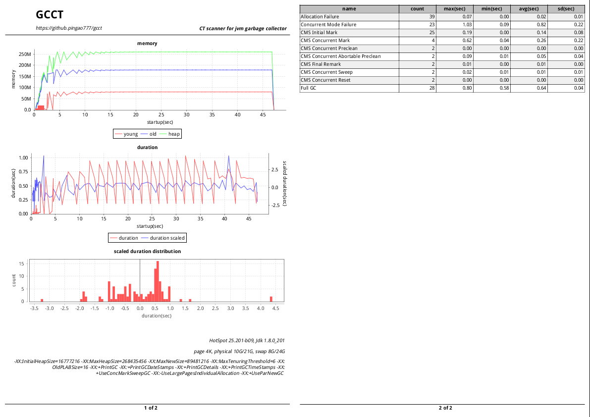
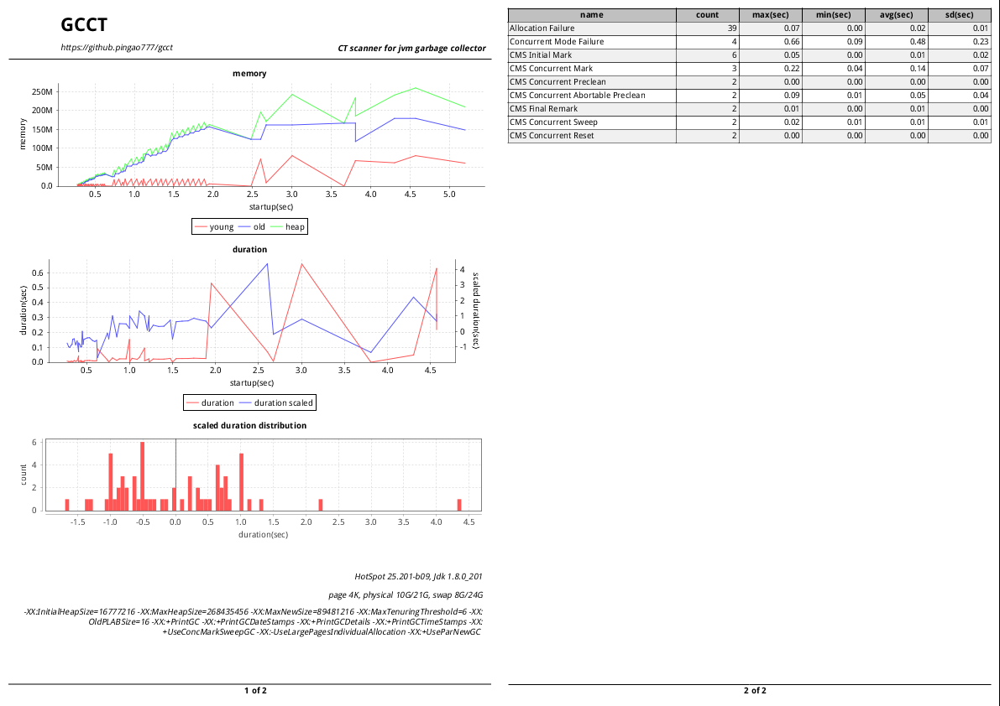

## GCCT(CT scanner for jvm garbage collector)

### Feature

- support g1 and cms.
- outliers check.
- period zoom out.

### Usage

```
java -jar gcct.jar -p /path/to/gc/log

parameter:
-h help
-p gc log path
-s startup start
-e startup end
```

### Example

First use the following command to have a glance,

```
java -jar gcct.jar -p /path/to/gc/log
```

- page 1: 
  - memory chart, x: relative startup time of jvm, y: memory value.
  - gc activity duration chart, x: relative startup time of jvm, left y: duration time of gc activity, right y: scaled duration time of gc activity(x -mean / d, aims to find outliers).
  - scaled gc activity duration distribution chart(x - mean / sd).
  - jvm info, including jvm version and jdk version.
  - memory info, including physical and swap.
  - commandline flags.
- page 2: gc activity summary.



If you want to take a closer look at one certain period of time, such as 0 to 5 sec, you can use the following command:

```
java -jar gcct.jar -p /path/to/gc/log -s 0 -e 5
```



In addition to observe the states of the jvm from the charts, you can also view the details of the gc activity from the table on page 2, including some abnormal behavior, such as **Concurrent Mode Failure**, which often indicates a serious problem.


